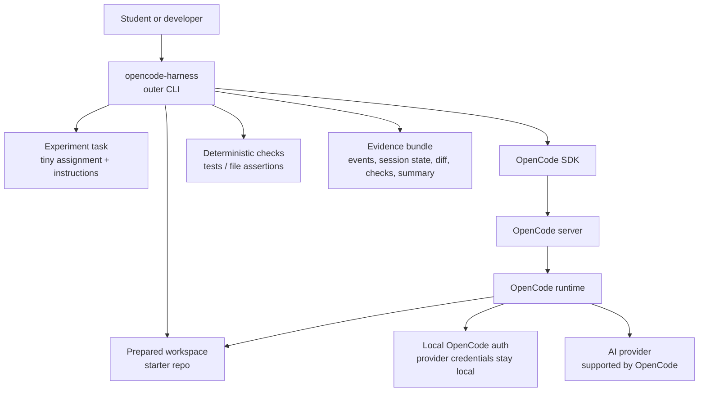
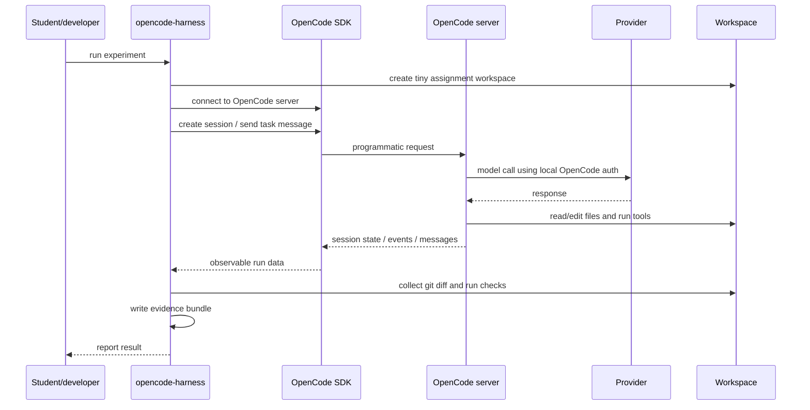

# OpenCode Harness SDK Experiment Plan

## Purpose

This repository probes whether OpenCode can be wrapped as a local,
user-authenticated coding-agent harness.

The experiment focuses on the OpenCode SDK/server path. It is not a product
slice, an education MVP, a grading tool, or an AI assessment system.

## Core Question

Can OpenCode's SDK/server be used as the runtime for a custom local
coding-agent harness?

More concretely:

- Can the harness start or connect to OpenCode server?
- Can it create or use an OpenCode session?
- Can it send a task message programmatically?
- Can OpenCode work inside a specific assignment workspace?
- Can the harness observe useful events or session state?
- Can it collect a final diff and file status?
- Can it run deterministic checks after the agent work?
- Can it write a local evidence bundle?
- Can this happen while provider auth stays local to OpenCode?

## Architecture



Plain version:

```text
The harness prepares a small coding task, talks to OpenCode through its
SDK/server, asks OpenCode to work on the task, then records what happened.
OpenCode remains the coding agent. The repository code is only the harness.
```

## Message Flow



## Planned Repository Shape

Implementation should stay small until the SDK/server control points are proven.

```text
README.md
docs/
  plan.md
examples/
  tiny-assignment/
    task.md
    starter/
    checks/
src/
  cli.ts
  opencode-session.ts
  workspace.ts
  evidence.ts
  checks.ts
runs/
  .gitkeep
```

The first implementation should not include a teacher dashboard, rubric engine,
generic provider abstraction, Codex adapter, backend upload service, or polished
interactive UI.

## Intended Command

The eventual command can look like:

```bash
opencode-harness run examples/tiny-assignment
```

The command should:

1. Copy the starter repo to a temporary run workspace.
2. Start or connect to OpenCode server.
3. Create a session.
4. Send the task prompt.
5. Wait for completion or timeout.
6. Collect SDK-visible session data.
7. Collect a git diff.
8. Run deterministic checks.
9. Write evidence files.

## Evidence Bundle

Each run should produce a local evidence bundle:

```text
runs/<run-id>/
  input/
    task.md
    harness-config.json
  raw/
    opencode-session.json
    opencode-events.jsonl
  workspace/
    final.diff
    file-status.json
  checks/
    checks.json
    test-output.txt
  summary.md
```

The bundle should make these facts inspectable:

- what task was given
- what OpenCode session happened
- what files changed
- what checks passed or failed
- what evidence was available
- what was missing or unsupported

## Success Criteria

The experiment succeeds if the SDK/server path can:

- connect reliably to OpenCode
- create or use a session
- send a task into a specific workspace
- expose enough state, events, messages, or session data to inspect the run
- let the harness collect file changes and check results
- produce an evidence bundle
- avoid reading or storing provider credentials

The experiment does not need to prove that the student understood the task,
worked independently, or used no external AI.

## Useful Failure Criteria

A negative result is still valuable if it clearly identifies the missing control
point. The experiment should document failure when:

- the SDK/server cannot target a workspace cleanly
- session events are too thin for inspection
- diff or session state is not accessible
- permissions cannot be configured or observed enough
- server lifecycle is too awkward for a local harness
- provider auth does not work in this mode without the harness handling secrets
- OpenCode's exposed data is too unstable to depend on

## Scope Guardrails

Do not add product features until the SDK/server substrate is validated.

Avoid:

- teacher dashboard
- learning-loop workflow
- grading or assessment claims
- transfer or understanding claims
- multi-provider framework
- Codex comparison
- backend upload
- authentication system

The repository should answer one question first:

```text
Can I build a custom local harness on top of OpenCode SDK/server?
```
