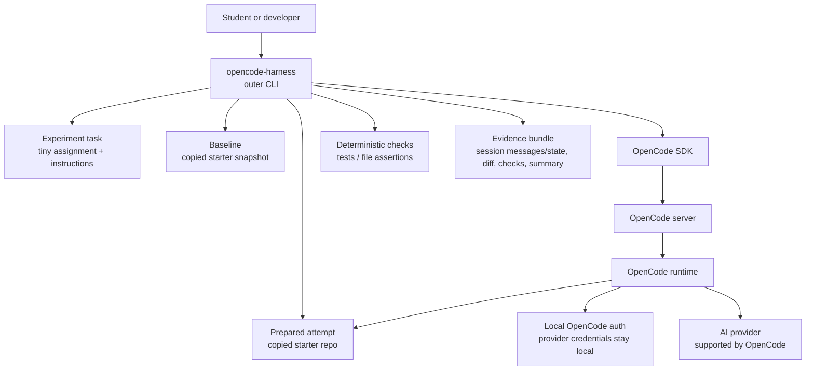
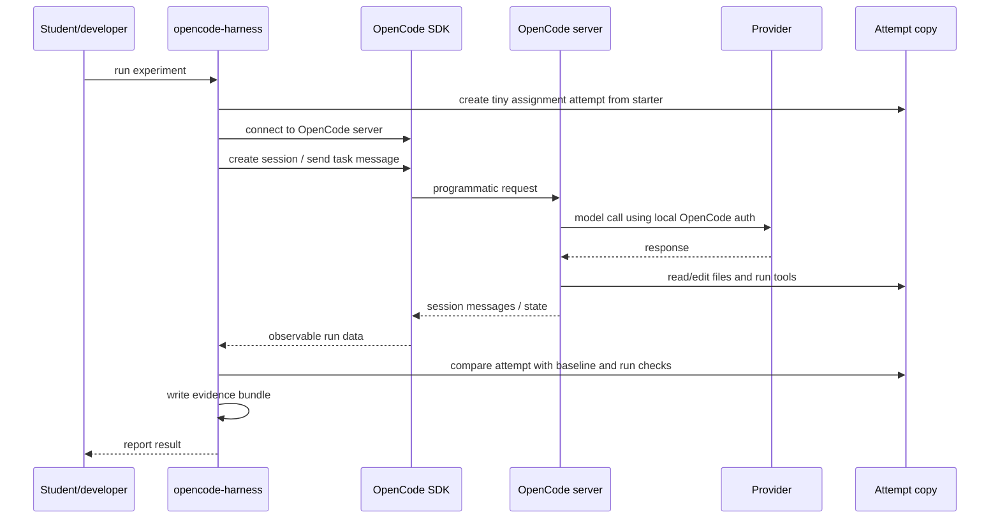

# OpenCode Harness SDK Experiment Plan

## Purpose

This repository probes whether OpenCode can be wrapped as a local,
user-authenticated coding-agent harness.

The experiment focuses on the OpenCode SDK/server path. It is not a product
slice, an education MVP, a grading tool, or an AI assessment system.

## Core Question

Can OpenCode's SDK/server be used as the runtime for a custom local
coding-agent harness?

More concretely:

- Can the harness start or connect to OpenCode server?
- Can it create or use an OpenCode session?
- Can it send a task message programmatically?
- Can OpenCode work inside a specific assignment attempt?
- Can the harness observe useful session messages/state?
- Can it collect a final diff and file status?
- Can it run deterministic checks after the agent work?
- Can it write a local evidence bundle?
- Can this happen while provider auth stays local to OpenCode?

## Architecture



Plain version:

```text
The harness prepares a small coding task, copies the starter files into a
disposable attempt directory, talks to OpenCode through its SDK/server, asks
OpenCode to work on that copy, then records what happened. OpenCode remains the
coding agent. The repository code is only the harness.
```

## Message Flow



## Planned Repository Shape

Implementation should stay small until the SDK/server control points are proven.

```text
README.md
docs/
  plan.md
examples/
  tiny-assignment/
    task.md
    starter/
    checks/
src/
  cli.ts
  opencode-session.ts
  attempt.ts
  evidence.ts
  checks.ts
runs/
  .gitkeep
```

The first implementation should not include a teacher dashboard, rubric engine,
generic provider abstraction, Codex adapter, backend upload service, or polished
interactive UI.

## Intended Command

The eventual command can look like:

```bash
opencode-harness run examples/tiny-assignment
```

The command should:

1. Copy the starter repo to `baseline/` and `attempt/`.
2. Start or connect to OpenCode server.
3. Create a session.
4. Send the task prompt.
5. Wait for completion or timeout.
6. Collect SDK-visible session messages/state.
7. Collect a git diff.
8. Run deterministic checks.
9. Write evidence files.

## Behavior Evidence Loop

The first implementation must prove one central behavior claim:

```text
Given a tiny assignment attempt, the harness can drive one OpenCode SDK/server
session, observe the run, collect attempt evidence, run checks, and write a
bundle that shows which harness control points worked or failed.
```

The implementing agent must run the CLI itself as the primary behavior check:

```bash
opencode-harness run examples/tiny-assignment
```

The result is not accepted from code inspection alone. The implementing agent
must inspect the produced run bundle and report which core questions were
observed, failed, unsupported, or not tested because a precondition was missing.

### Primary Scenario

Use one real fixture assignment with a deterministic failing check.

```text
Given:
- an example assignment with task.md
- a starter baseline copy and an editable attempt copy
- a check command that fails before the agent change
- local OpenCode auth already configured by the user

When:
- `opencode-harness run examples/tiny-assignment` is executed

Then:
- the harness starts or connects to OpenCode server
- creates or uses one session
- sends the task message
- targets the prepared attempt
- captures SDK-visible session messages/state
- collects final diff and file status without creating a nested Git repo
- runs the deterministic check
- writes a run evidence bundle
- never asks for or stores provider credentials
```

### Evidence Matrix

Each core question must map to a concrete artifact in the run bundle.

| Question | Evidence artifact | Success signal | Failure signal |
| --- | --- | --- | --- |
| Can the harness connect to OpenCode server? | `raw/server.json` or `summary.md` | Server connection recorded | No server connection or only inferred state |
| Can it create/use a session? | `raw/opencode-session.json` | Session id/state present | No session id/state |
| Can it send a task message? | `raw/opencode-session.json` session messages | Task message visible | No observable task message |
| Can it target the attempt directory? | `input/attempt.json`, `changes/file-status.json` | Run path matches prepared attempt | Edits/checks happen outside the attempt |
| Can it observe useful state? | `raw/opencode-session.json` session messages/state | Messages, tool records, or session state present | Raw data too thin or missing |
| Can it collect diff/status? | `changes/final.diff`, `changes/file-status.json` | Changed files captured by comparing `baseline/` and `attempt/` | Missing or empty despite changes |
| Can it run checks? | `checks/checks.json`, `checks/test-output.txt` | Command, exit code, output captured | Check not run or output absent |
| Can it write a bundle? | `runs/<run-id>/summary.md` | All expected files listed with statuses | Incomplete or inconsistent bundle |
| Does provider auth stay local? | `summary.md`, config snapshot | Harness took no provider key/token input and stores no credentials | Harness requires or writes provider credentials |

### Comparison Rule

The run is successful only if `summary.md` marks every core question as one of:

```text
observed
failed
not supported by current OpenCode surface
not tested because precondition missing
```

No question may be silently omitted.

### Preflight And Human Action

The CLI should have a preflight path that checks whether OpenCode and local
provider auth appear available before attempting a real run.

If implementation or validation requires human action, the implementing agent
must stop and ask for that action. It must not work around the requirement,
fabricate credentials, paste tokens into the repo, or mark the behavior loop as
passed.

Human action is required when:

- OpenCode is not installed and installation is not in the agreed scope
- local provider auth is missing or expired
- OpenCode requires an interactive browser/device login
- a permission prompt requires a human choice
- provider terms, account selection, or paid usage requires human judgement

Missing human action should be recorded as:

```text
not tested because precondition missing
```

### Local Repair Rule

The implementation may be repaired locally when the failure is inside the
harness:

- wrong attempt path
- nested Git metadata accidentally created under `runs/`
- missing output file
- bad check execution
- malformed summary
- SDK call misuse
- event capture bug

Stop instead of patching around the problem when the failure is an OpenCode
surface limitation, missing local provider auth, undocumented SDK behavior, or a
change that would require broad product architecture.

### Stop Conditions

Stop and document the result when:

- OpenCode SDK/server cannot be controlled without manual steps
- no local OpenCode auth is available for a real run
- session data is too thin to answer the evidence matrix
- attempt targeting cannot be verified
- provider credentials would need to be handled by the harness
- proving the behavior requires adding product features outside this experiment

### Handoff Evidence

Every implementation handoff must include:

- the command that ran the loop
- the run id
- path to `summary.md`
- which core questions were observed, failed, unsupported, or not tested
- whether checks passed or failed
- whether any provider-auth or trace-confidence limitation remains

## Evidence Bundle

Each run should produce a local evidence bundle:

```text
runs/<run-id>/
  input/
    task.md
    harness-config.json
  raw/
    opencode-session.json
    opencode-events.jsonl
  baseline/
    ...
  attempt/
    ...
  changes/
    final.diff
    file-status.json
  checks/
    checks.json
    test-output.txt
  summary.md
```

The bundle should make these facts inspectable:

- what task was given
- what OpenCode session happened
- what messages/state were visible through the SDK
- what files changed between `baseline/` and `attempt/`
- what checks passed or failed
- what evidence was available
- what was missing or unsupported

## Success Criteria

The experiment succeeds if the SDK/server path can:

- connect reliably to OpenCode
- create or use a session
- send a task into a specific attempt directory
- expose enough messages or session state to inspect the run
- let the harness collect file changes and check results
- produce an evidence bundle
- avoid reading or storing provider credentials

The experiment does not need to prove that the student understood the task,
worked independently, or used no external AI.

## Useful Failure Criteria

A negative result is still valuable if it clearly identifies the missing control
point. The experiment should document failure when:

- the SDK/server cannot target an attempt directory cleanly
- session messages/state are too thin for inspection
- diff or session state is not accessible
- permissions cannot be configured or observed enough
- server lifecycle is too awkward for a local harness
- provider auth does not work in this mode without the harness handling secrets
- OpenCode's exposed data is too unstable to depend on

## Scope Guardrails

Do not add product features until the SDK/server substrate is validated.

Avoid:

- teacher dashboard
- learning-loop workflow
- grading or assessment claims
- transfer or understanding claims
- multi-provider framework
- Codex comparison
- backend upload
- authentication system

The repository should answer one question first:

```text
Can I build a custom local harness on top of OpenCode SDK/server?
```

## Current Verification Boundary

The first successful run shows that the core trace does not need streamed event
capture to be useful. The load-bearing product trace is:

```text
assignment input
-> OpenCode session messages/state
-> diff/status between baseline and attempt
-> check command results
-> summary of observed/missing control points
```

`raw/opencode-events.jsonl` may stay in the bundle as an optional future
artifact, but it is not required for the current architecture claim. The current
claim is therefore narrow:

```text
OpenCode can be wrapped by a local harness that drives one coding-agent attempt
and writes inspectable evidence of the task, session, file changes, checks, and
provider-auth boundary.
```

This still does not prove independent understanding, concept transfer, or
absence of outside AI use.
